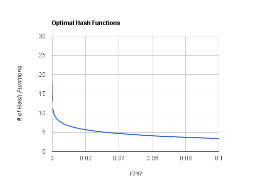

BioBloom Tools User Manual
======
BioBloom Tools (BBT) provides the means to create filters for a given reference and then to categorize sequences. This methodology is faster than alignment but does not provide mapping locations. BBT was initially intended to be used for pre-processing and QC applications like contamination detection, but is flexible to accommodate other purposes. This tool is intended to be a pipeline component to replace costly alignment steps.

Relevant [paper](http://bioinformatics.oxfordjournals.org/content/30/23/3402.long).

This tool is free for academic use ([BCCA licence](COPYING)).

We have a commercial licence also, please contact us (prebstein at bccancer dot bc dot ca) if you wish to use the tools for commercial uses.

Any questions, comments and suggestions can be directed to [JustinChu](https://github.com/JustinChu) or emailed to cjustin at bcgsc dot ca.

######Affiliations:
Canada’s Michael Smith Genome Sciences Centre, BC Cancer Agency, Vancouver BC Canada V5Z 4S6

Department of Bioinformatics, University of British Columbia, Vancouver BC V6T 1Z4

Table of Contents
------
1. [Compiling and Installing BioBloomTools](#1)
  * Dependencies
  * How to Install
2. [Generating Bloom Filters from Reference Sequence with Biobloommaker](#2)
3. [Classifying and Analyzing Sequences with Biobloomcategorizer](#3)
4. [Program Outputs](#4)
  * Biobloommaker
    * Bloom Filter File (filterID.bf)
    * Bloom Filter Info File (filterID.txt)
  * Biobloomcategorizer
    * Summary File (summary.tsv)
    * Categorized Sequence FastA/FastQ Files
5. [Understanding BioBloomTools](#5)
  * About Bloom Filters
  * How false positive rates correlates to memory usage
  * How many hash functions should be used?
  * K-mer Tiling and Reduction of the effect of false positive k-mers
  * What is inside the Bloom Filter Info File?
    * Obtaining the number of unique k-mers in the reference
    * Obtaining the number of redundant k-mers in the reference
6. [Advanced options and Best Practices](#6)
 
<a name="1"></a>
1. Compiling and Installing BioBloomTools
------
#####Dependencies:
* GCC (tested on 4.8.4)
* Boost (tested on 1.54)
* zlibdev
* Autotools (if directly cloning from repo)

#####Compilation:
If cloning directly from the repository run:
```
./autogen.sh
```
Compiling BioBloomTools should be as easy as:
```
./configure && make
```
To install BBT in a specified directory:
```
./configure --prefix=/BBT/PATH && make install
```
If your boost library headers are not in your PATH you can specify their location:
```
./configure –-with-boost=/boost/path --prefix=/BBT/PATH && make install
```

<a name="2"></a>
2. Generating Bloom Filters from Reference Sequences with Biobloommaker
------
To create bloom filters from a FastA file, the FastA file must by indexed. Indexing can
be done by programs like [samtools](https://github.com/samtools/samtools) (faidx) or [fastahack](https://github.com/ekg/fastahack).

After you have your FastA file and index, a .bf file with corresponding information text
file can be created by running the command:
```
./biobloommaker –p input input1.fasta input2.fasta
```
`-p` is the prefix for the files being created, it also acts as an ID for the filter.

The options above are the bare minimum options you must use to run the program, but it is possible to customize many aspects of your filter that can drastically change performance depending on your needs. See section 5 for advanced options. You can also use the -h command for a listing of the options.

The optimal size of the filter will be calculated based on the maximum false positive rate (default is 0.075) and the number of hash functions (can be set but is optimized based on FPR).

Two files will be generated binary Bloom filter file (.bf) and an information file in INI format (.txt). The information file must be kept with the .bf file to provide all the needed information to run the categorization.

<a name="3"></a>
3. Classifying and Analyzing Sequences with Biobloomcategorizer
------
Once you have filters created, you can use them with Biobloomcategorizer to categorize sequences. The file formats that can be used are the following: SAM, BAM, FastQ, FastA and qseq. Gzip and Bz2 compression is also handled if your system has gzip and bunzip2 installed.

Before starting make sure the listed .bf file is in the same directory as its corresponding information .txt file.

A summary.tsv file, readStatus.tsv summary file, and FastA files containing categorized reads can be generated with the following command:
```
./biobloomcategorizer –-fa –p /output/prefix –f ”filter1.bf filter2.bf filter3.bf” inputReads1.bam.bz2 inputreads2_qseq.txt
```
`-p` is the output directory for the output files.
`-f` is the filter(s) you used to categorize the sequences. You can specify as many as
you need.

There are some advanced options open can use outlined in section 5. Notable option
one can use is the paired end mode `-e`:
```
./biobloomcategorizer -e –p /output/prefix –f ”filter1.bf filter2.bf filter3.bf” inputReads1_1.fq inputreads1_2.fq
```
`-e` will require that both reads match when making the call about what reference they belong in.

By default `-e` will only count a read if both reads match a filter. If you want only it to count situations where only one read matches the filter then the `-i` (`--inclusive`) option can also be used.

These are general use cases you can use to run the program, but it is possible to customize many aspects of your filter that can drastically change performance depending on your needs. See section 5 for advanced options. You can also using the `-h` command for a listing on the options.

<a name="4"></a>
4. Program Output
------
#####A. Biobloommaker
######i. Bloom Filter File (filterID.bf)

* Simply a bit array representing the bloom filter dumped as a file. It is simple, so that it can be used in     almost any system format. It is useless without its paired info file however.

######ii. Bloom Filter Info File (filterID.txt)

* This is the information file of the bloom filter, containing the information like false positive rate and hash functions used. It is in human readable INI format. It is intended to be read by Biobloomcategorizer in tandem with its paired .bf file to perform categorization.

#####B. Biobloomcategorizer
######i. Summary File (summary.tsv)

* Tab separated file. Contains proportion information about reads mapping
to each filter. Give a good overview of your results

######ii. Categorized Sequence FastA/FastQ Files

* In the output directory there will be files for every filter used in addition to “multiMatch” and “noMatch” files. The reads will be categorized in these locations based on the threshold (-m and -t) values used.
* Reads outputted will have a value (e.g. “/1”) appended to the end of each ID to denote pair information about the read.

<a name="5"></a>
5. Understanding BioBloomTools
------

#####A. About Bloom Filters
The whole idea of using bloom filter centers on getting the time complexity of a hash (i.e. a O(1) time complexity for look-ups) with a lower space requirement. This is resolved in a bloom filter by not storing the entry, but rather storing the entry’s bit signature (determined via hashing) in a bit array. However, this means there is no collision detection and all bloom filters will have some sort of false positive rate associated with them. The false positive rate must be carefully considered as it determines the expected size of the filter used. Too small of a false positive rate can mean a large bloom filter, but too large of a false positive rate could introduce too much error for the filter to be practical.

#####B. How false positive rates correlates to memory usage


This figure shows the relationship (assuming optimal number of hash functions have been used) between false positive rate and the space cost per entry. To use this chart divide your amount of space in bits you have to work with to the number base pairs you have in your reference.

For example, say I want the human genome (~ 3.4×10^9) filter to fit into~3GB of memory. (8×3×230)/4×10^9 = ~8bits per entry, meaning a filter with 2% FPR at maximum should be used.

#####C. How many hash functions should be used?



The number of hash functions refers to the number of hash functions used by a single filter per element. In practice the approximate optimal number of hash functions will be calculated automatically by our program.

We give users the ability to change the number of hash functions because very low false positive rates will have an optimal number of associated hash functions that may be very large and may slow down classification. Also it is recommended that if running multiple filters at the same time that they all use the same number of hash functions.

#####D. K-mer Tiling
We use a sliding window across each read of size k to categorize sequences. Single base overlaps that both hit a filter are unlikely to be false positives. This information is used to reduce the effect of any false positives. This concept is also used to further improve speed, we also employ a jumping k-mer (rather than sliding) heuristic that skips k k-mers when a miss is detected after a long series of adjacent hits.

#####E. What is inside the Bloom Filter Info File?

######i. Obtaining the number of unique k-mers in the reference:
Within the information txt file for each bloom filter there is a “num_entries” entry that lets you know how many unique k-mers have been added to the filter. It is a lower bound estimate due to possible false positives.

######ii. Obtaining the number of redundant k-mers in the reference:
Within the information txt file for each bloom filter there is a “redundant_sequences” entry that lets you know how many redundant k-mers have been added to the filter. It is an upper bound estimate due to possible false positives. The “redundant_fpr” represents the probability that any one random redundant k-mer is actually unique. Thus, to get the approximate number of unique k-mers take the “redundant_fpr” value and multiply it with the “redundant_sequences” sequences and add that to the “num_entries”.

<a name="6"></a>
6. Advanced options and Best Practices
------

This section is out of date, updates to this section will be added

#####A. How can I reduce my memory usage?

Memory usage is directly dependent on the filter size, which is in turn a function of the false positive rate. In biobloommaker reducing memory increases the false positive rate (-f) until the memory usage is acceptable. You may need to increase score threshold (-s) in biobloomcategorizer to keep the specificity high.

#####B. How can I make my results more sensitive?

In biobloomcategorizer try to decrease the score threshold (-s). If that still does not work, in biobloommaker try reducing the k-mer (-k) size to allow more tiles, which can help with sensitivity.

#####C. How can I make my results more specific?

In biobloomcategorizer you can increase score threshold (-s).

In biobloommaker decreasing the false positive rate (-f) and increasing the k-mer (-k) size to allow more tiles can help with specificity. Decreasing the filter false positive rate will increase memory usage.

#####D. How can I make the program faster?

In biobloomcategorizer use a min hit threshold (-m) of 1. This will use a faster rescreening categorization algorithm that uses jumping k-mer tiles to prescreen reads. This will decrease sensitivity but will increase speed. Large values will further decrease sensitivity.

Using the min hit threshold only (-o) option will use only this screening method and not use the standard sliding tiles algorithm at all. This will greatly increase speed at the expense of sensitivity and specificity. This may be appropriate if your reads are long (>150bp), paired and have minimal read errors. If this method is used, it is recommended that you use an -m of at least 2 or 3.

